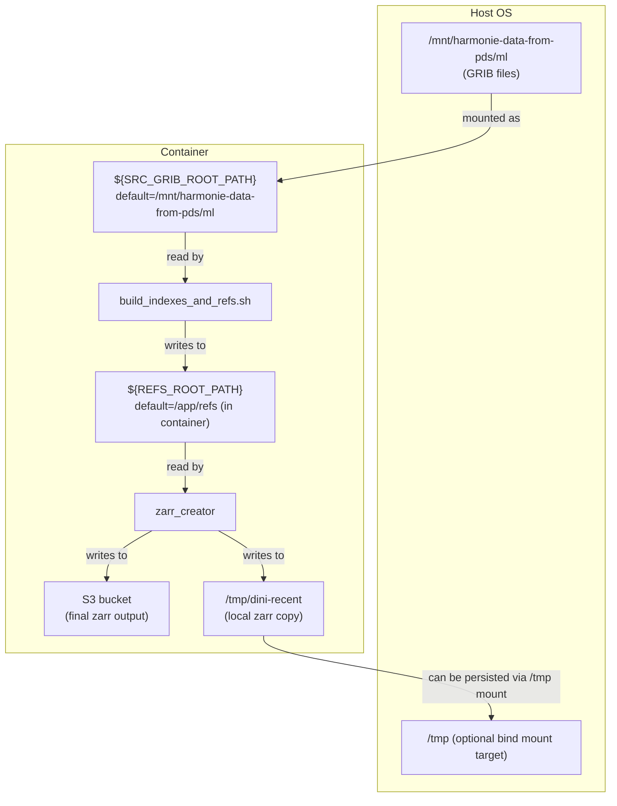
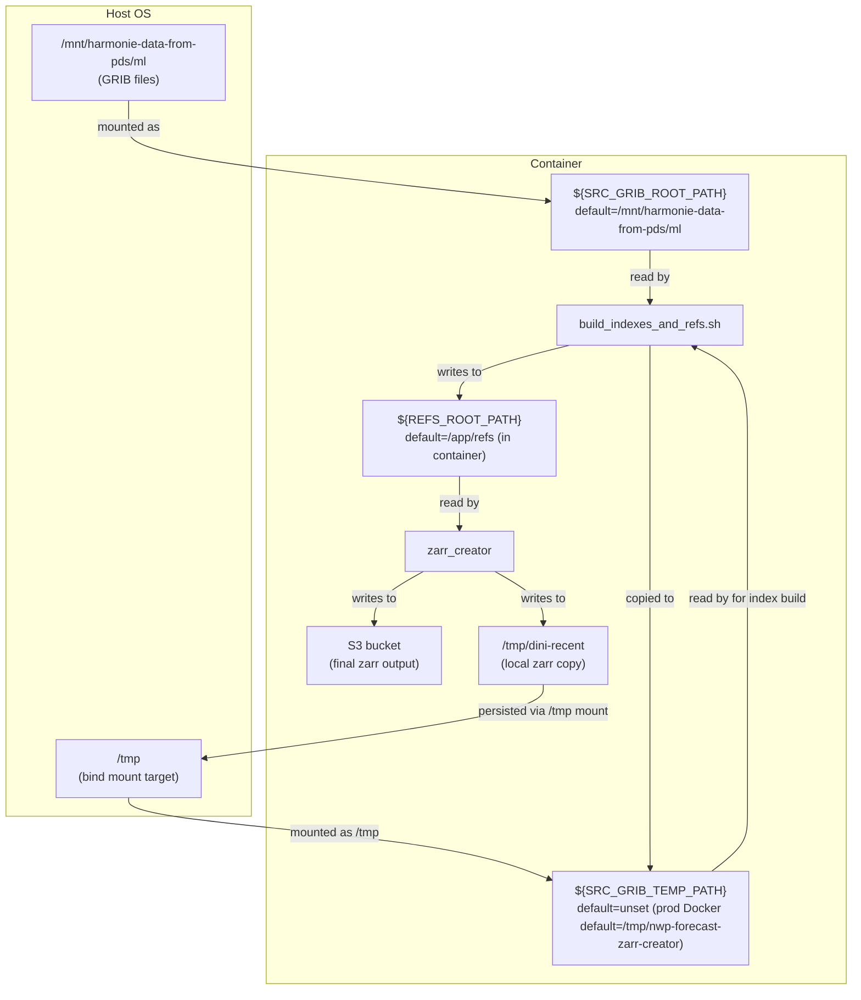

# NWP Forecast in zarr format

This repository contains the code to process DINI GRIB files into zarr format.

For local VS Code + Docker development, see [DEVELOPING.md](DEVELOPING.md).

Currently, this writes all pressure-level fields to `pressure_levels.zarr`,
height-level fields to `height_levels.zarr` and everything else to
`single_levels.zarr`. We do not currently transfer and convert model-level
fields. These are written to

`s3://harmonie-zarr/dini/control/2025-03-03T060000Z/single_levels.zarr`

e.g. the prefix format is:

`s3://harmonie-zarr/{suite_name}/{member}/{analysis_time}/[part_id}.zarr`


NB: note that for DINI we have fewer height-levels and so I have only included `50m`, `100m`, `150m` and `250m`. In addition a number of variables aren't in DINI or at least I don't understand what the variables that are there all mean. To see what is included please have a look at [zarr_creator/config.py](zarr_creator/config.py).


## Usage

### Periodic running

For now running the conversion to zarr and writing to s3 the `run.sh` script
should be executed in for example a tmux session.

### Manually running

Running the conversion manually requires two steps:

1. Build GRIB indexes and and refs by calling GRIB scan directly:

```bash
./build_indexes_and_refs.sh 2025-02-27T15:00Z
```

This writes refs to `refs/`. If you want to copy source GRIB files to a
temporary location before indexing, set `SRC_GRIB_TEMP_PATH` as an environment
variable.

2. Read the refs, build the three datasets (height-levels, pressure-levels and single-levels) as `xr.Datasets` and write each to the target s3 bucket:

```bash
uv run python -m zarr_creator --t_analysis 2025-02-27T15:00:00Z
```

## Runtime Defaults

Shared runtime defaults are defined in `script_defaults.sh`.
Both `run.sh` and `build_indexes_and_refs.sh` source this file.

You can override any default by exporting the corresponding environment variable
before running either script.

| Variable | Script default | Default in container | Meaning |
|---|---|---|---|
| `SRC_GRIB_ROOT_PATH` | `/mnt/harmonie-data-from-pds/ml` | *as script default* | Path where source GRIB forecast files are read from. |
| `REFS_ROOT_PATH` | `/home/ec2-user/nwp-forecast-zarr-creator/refs` | `/app/refs` | Directory where gribscan refs are written. |
| `SRC_GRIB_TEMP_PATH` | _unset_ | `/tmp/nwp-forecast-zarr-creator` | If set, GRIB files are copied to this temporary working directory before indexing. If unset, files are indexed directly from `SRC_GRIB_ROOT_PATH`. |
| `MEMBER_ID` | `CONTROL__dmi` | *as script default* | Forecast member identifier in file names. |
| `MAX_HOUR` | `36` | *as script default* | Maximum forecast hour included by `build_indexes_and_refs.sh` (inclusive, `000..MAX_HOUR`). |

For the dev container (`docker-compose.dev.yml`), `SRC_GRIB_TEMP_PATH` is
unset.

Example overrides:

```bash
export MAX_HOUR=12
export SRC_GRIB_TEMP_PATH=/tmp/nwp-forecast-zarr-creator
./build_indexes_and_refs.sh 2025-02-27T15:00:00Z
```

Data flow when `SRC_GRIB_TEMP_PATH` is **unset** (default script behavior):



Data flow when `SRC_GRIB_TEMP_PATH` is **set** (copy-before-indexing):



## Runtime Defaults

Shared runtime defaults are defined in `script_defaults.sh`.
Both `run.sh` and `build_indexes_and_refs.sh` source this file.

You can override any default by exporting the corresponding environment variable
before running either script.

| Variable | Script default | Default in container | Meaning |
|---|---|---|---|
| `SRC_GRIB_ROOT_PATH` | `/mnt/harmonie-data-from-pds/ml` | *as script default* | Path where source GRIB forecast files are read from. |
| `REFS_ROOT_PATH` | `/home/ec2-user/nwp-forecast-zarr-creator/refs` | `/app/refs` | Directory where gribscan refs are written. |
| `SRC_GRIB_TEMP_PATH` | _unset_ | `/tmp/nwp-forecast-zarr-creator` | If set, GRIB files are copied to this temporary working directory before indexing. If unset, files are indexed directly from `SRC_GRIB_ROOT_PATH`. |
| `MEMBER_ID` | `CONTROL__dmi` | *as script default* | Forecast member identifier in file names. |
| `MAX_HOUR` | `36` | *as script default* | Maximum forecast hour included by `build_indexes_and_refs.sh` (inclusive, `000..MAX_HOUR`). |

For the dev container (`docker-compose.dev.yml`), `SRC_GRIB_TEMP_PATH` is
unset.

Example overrides:

```bash
export MAX_HOUR=12
export SRC_GRIB_TEMP_PATH=/tmp/nwp-forecast-zarr-creator
./build_indexes_and_refs.sh 2025-02-27T15:00:00Z
```

Data flow when `SRC_GRIB_TEMP_PATH` is **unset** (default script behavior):


Data flow when `SRC_GRIB_TEMP_PATH` is **set** (copy-before-indexing):


### Intake Catalog Usage

There are two ways to easily read the converted zarr datasets easily from AWS S3
using the intake catalog in this repo. Either by reading the intake catalog directly from github, or by installing the `zarr_creator` package and using the `open_intake_catalog()`.

#### 1. Open the catalog directly from GitHub

```python
import intake
import isodate

analysis_time = isodate.parse_datetime("2026-02-16T00:00:00Z")
catalog = intake.open_catalog(
    "https://raw.githubusercontent.com/dmidk/nwp-forecast-zarr-creator/main/zarr_creator/catalog/catalog.yml"
)
ds_dini_hl = catalog["height_levels"]._entry(analysis_time=analysis_time).to_dask()
```

#### 2. Open the packaged catalog with `open_intake_catalog()`

```python
import isodate

from zarr_creator import open_intake_catalog

analysis_time = isodate.parse_datetime("2026-02-16T00:00:00Z")
catalog = open_intake_catalog()
ds_dini_hl = catalog["height_levels"]._entry(analysis_time=analysis_time).to_dask()
```

# TODO

- most of the execution takes place in `run.sh` which orchestrates the retry if something goes wrong. This could be rewritten in python. I found it easier to start by prototyping this as a batch script.
- creation of GRIB indexes and refs from the indexes are done in a bash script `build_indexes_and_refs.sh` and is done by directly with gribscan (using the gribscan command-line interface) rather than using the dmi "data-catalog" python package `dmidc`. This was done because it turns out that DINI uses the special paramId for for example u-wind at 10m and 100m which is different from the parameter IDs for u-wind in general. This made calling the data-catalog cumbersome. Also, calling gribscan directly makes it more explicit how variables are mapped by level-type into the `height_levels.zarr`, `presure_levels.zarr` and `single_levels.zarr` more explicit. The bash script could be replaced with python code though.
- The writing of the output zarr datasets sometimes fails. I think this is due to issues in eccodes, but I am not sure. It could also be due to s3fs (FUSE) mounts being a bit brittle. In least in my experience copying the source GRIB files from the mounted s3 bucket avoid similar issues when creating the GRIB-indexes. Maybe something similar is needed when writing to the s3 bucket (i.e. create zarr then write to the bucket). I think it would better to use `fsspec`'s `s3` protocol implementation for reading and writing to/from s3 buckets instead of relying on s3fs
- the periodic running could be done in python too rather than relying on a do-loop in a bash script.


# Running with Docker

To enable running on AWS EC2 in Amazon Linux 2 we provide a Dockerfile. This was because:

- python `eccodes<2.43.0` requires system install of the ecCodes C library
  (`eccodes>=2.37.0,<2.43.0` wheels should include the C library, but they
  don’t)
  - system eccodes (`2.30.0`) C library was unstable and crashed frequently when
    used with `<2.43.0` python lib.
  - Compiling a newer ecCodes manually failed because it requires `cmake>3.12`,
    which Amazon Linux 2 doesn’t provide.
- python `eccodes>=2.43.0`: switched to `eccodeslib` python for C bindings, but
  no wheels exist for `eccodeslib` for Amazon Linux.

So we run everything inside a container with a known-good ecCodes installation,
so we have a consistent and reproducible environment.


Build image:

```bash
docker build -t nwp-forecast-zarr-creator .
```

Run container:

```bash
docker run --rm -it -v /mnt/:/mnt/ -v /tmp/:/tmp/ nwp-forecast-zarr-creator:latest
```

In the production Docker image, `SRC_GRIB_TEMP_PATH` is set by default to
`/tmp/nwp-forecast-zarr-creator`, so GRIB files are copied before indexing
unless you override `SRC_GRIB_TEMP_PATH`.

Regarding the volume mounts:
- The S3-buckets used for reading data are expected to be mounted in `/mnt/`
  (e.g. using `s3fs`), so we map them into the container from the system.
- By mounting the `/tmp` path to the system one we avoid having to copy the
  files on every execution by using the system storage as a cache.
